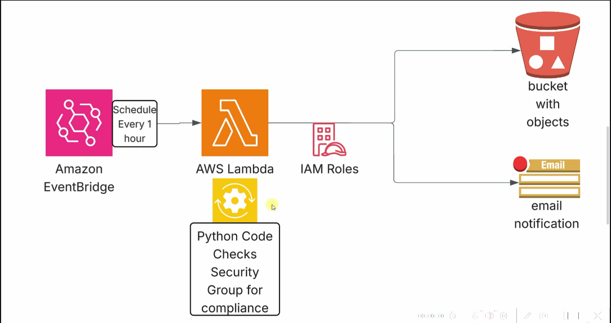

# Project: AWS Security Group Compliance Checker

## Project Description

Build a **serverless AWS Security Group Compliance Checker** that automatically audits Security Group configurations at regular intervals and identifies rules that violate predefined security policies.

The solution should use **Amazon EventBridge** to trigger an **AWS Lambda** function every hour. The Lambda function should inspect Security Groups within the AWS account, verify them against the defined compliance rules, generate a compliance report, store the report in an **Amazon S3 bucket**, and send an **email notification** containing the audit results.

---

## Project Requirements

1. Create an **Amazon S3 bucket** to store compliance reports generated by the Lambda function.

2. Create an **IAM Role** for the Lambda function with the minimum permissions required to:

   * Read EC2 Security Groups
   * Upload reports to Amazon S3
   * Send email notifications using Amazon SNS (or another AWS-supported email service)

3. Develop an **AWS Lambda function (Python)** that:

   * Retrieves all Security Groups in the AWS account.
   * Checks each Security Group against predefined compliance rules.
   * Identifies non-compliant Security Groups (for example, unrestricted inbound access such as `0.0.0.0/0` on sensitive ports like **22 (SSH)** or **3389 (RDP)**).
   * Generates a compliance report in a readable format (JSON or CSV).
   * Uploads the report to the configured S3 bucket.
   * Sends an email notification summarizing the compliance results.

4. Configure an **Amazon EventBridge Rule** to automatically invoke the Lambda function **every hour**.

5. Verify that:

   * Compliance reports are successfully stored in the S3 bucket.
   * Email notifications are received after every scheduled execution.
   * The solution continues to run automatically without manual intervention.

---

## GitHub Repository Must Include

* Complete source code of the Lambda function.
* `README.md` containing:

  * Project overview
  * Architecture diagram
  * AWS services used
  * IAM permissions required
  * Deployment and configuration steps
  * Compliance rules implemented
  * Sample compliance report
  * Lambda Function Code file
  * Screenshots of:

    * EventBridge Rule
    * Lambda Function
    * IAM Role
    * S3 Bucket with generated reports
    * Email notification received
    * Successful Lambda execution (CloudWatch Logs or Lambda Monitor)
  * Challenges or issues encountered during development

---

## Expected Outcome

At the end of this project, the solution should automatically perform periodic Security Group compliance checks, archive audit reports in Amazon S3, and notify administrators via email whenever the compliance scan is completed. The entire workflow should operate using AWS serverless services with no manual execution required.

## Project pipeline

