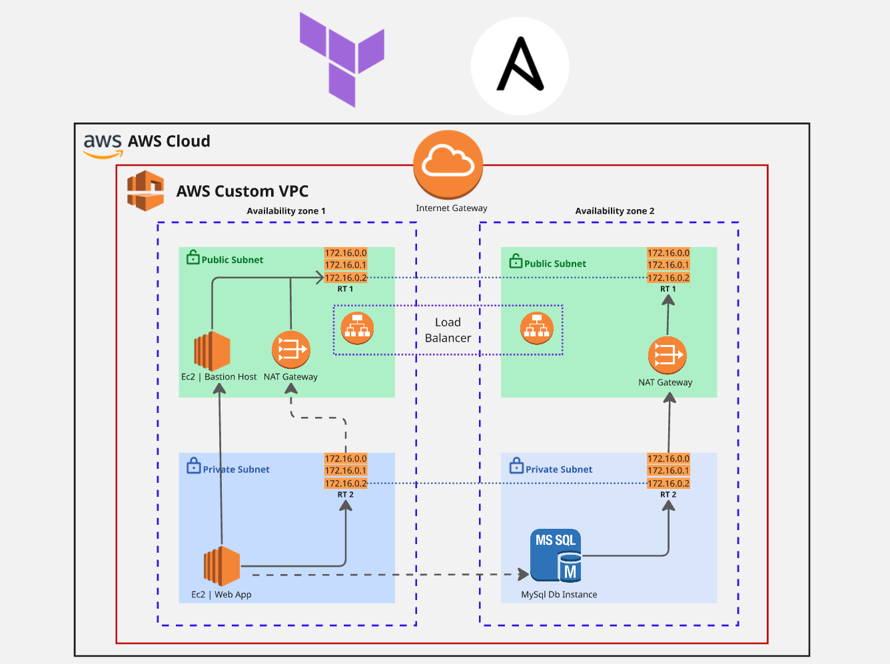

# Project: Highly Available Three-Tier AWS Infrastructure with Terraform & Ansible

## Project Description

Build a **Highly Available Three-Tier AWS Infrastructure** on AWS using **Terraform** for infrastructure provisioning and **Ansible** for server configuration and application deployment.

The project should provision a complete AWS environment including a **custom VPC**, **public and private subnets across multiple Availability Zones**, **Internet Gateway**, **NAT Gateway**, **Application Load Balancer**, **EC2 instances**, and an **Amazon RDS MySQL database** using Terraform.

After the infrastructure is created, use **Ansible** to automatically configure the EC2 instances by installing the required software, deploying the web application, and preparing the application server to communicate with the MySQL database.

---

## Project Requirements

### Infrastructure Provisioning (Terraform)

1. Create a **custom VPC** with an appropriate CIDR block.

2. Provision the networking resources:

   * Internet Gateway
   * Public and Private Subnets across at least **two Availability Zones**
   * Public and Private Route Tables
   * NAT Gateway

3. Configure Route Tables and associate them with the appropriate subnets.

4. Launch the following AWS resources:

   * Bastion Host in a Public Subnet
   * Web Application EC2 Instance(s) in Private Subnet(s)
   * Amazon RDS MySQL Instance in Private Subnet(s)
   * Create an **Application Load Balancer (ALB)** to distribute incoming traffic to the Web Application instances.

5. Configure Security Groups to allow only the required communication between:

   * Internet → Load Balancer
   * Bastion Host → Web Server
   * Web Server → MySQL Database

---

### Server Configuration & Deployment (Ansible)

6. Configure the Web Server EC2 instance(s) using Ansible by:

   * Installing Nginx
   * Deploying a sample web application
   * Configuring the web server
   * Starting and enabling the Nginx service

7. Configure the application server with the required MySQL client packages and verify connectivity to the Amazon RDS MySQL instance.

8. Verify that:

   * Infrastructure is successfully provisioned using Terraform.
   * The web application is accessible through the Application Load Balancer.
   * The Bastion Host can securely access the private EC2 instance.
   * The Web Server can communicate with the MySQL database.
   * All server configuration is completed automatically using Ansible playbooks.

---

## GitHub Repository Must Include

* Complete Terraform configuration files.
* Complete Ansible playbooks and inventory files.
* `README.md` containing:

  * Project overview
  * Architecture diagram
  * AWS services used
  * Folder structure
  * Terraform initialization and deployment steps
  * Ansible execution steps
  * Deployment verification steps
  * Terraform files
  * Screenshots of:
    * Terraform Apply Output
    * VPC
    * Subnets
    * Route Tables
    * Internet Gateway
    * NAT Gateway
    * Security Groups
    * EC2 Instances
    * Bastion Host Login
    * Application Load Balancer
    * Target Group Health Check
    * Amazon RDS MySQL Instance
    * Successful Ansible Playbook Execution
    * Nginx running on the Web Server
    * Web Application accessible through the Load Balancer
  * Challenges or issues encountered during implementation

---

## Expected Outcome

At the end of this project, a complete three-tier AWS infrastructure should be provisioned using **Terraform**, while **Ansible** should automatically configure the web servers, install Nginx, deploy the application, and prepare the servers for database connectivity. The final solution should demonstrate an end-to-end DevOps workflow by combining Infrastructure as Code with Configuration Management to create a secure, scalable, and highly available cloud environment.

## Project pipeline

