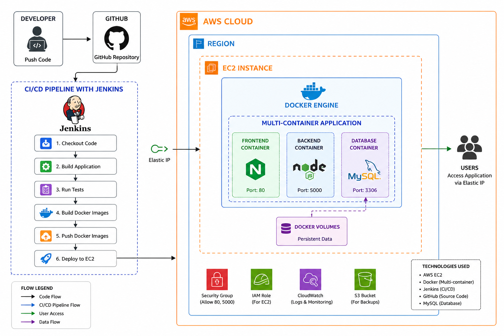

# Project: Multi-Container Application Deployment on AWS using Docker & Jenkins CI/CD

## Project Description

Build and deploy a **multi-container web application** on an **Amazon EC2** instance using **Docker** and automate the complete deployment process using a **Jenkins CI/CD Pipeline**.

The application should consist of separate **Frontend**, **Backend**, and **MySQL Database** containers managed through **Docker Compose**. Source code should be hosted on **GitHub**, and every code push should automatically trigger a Jenkins pipeline to build the application, run tests, create Docker images, push them to **Docker Hub**, and deploy the latest version to the EC2 instance.

The project should demonstrate a complete end-to-end DevOps workflow, from source code management to automated deployment on AWS.

---

## Project Requirements

### Infrastructure Setup

1. Launch an **Amazon EC2** instance to host the application.

2. Configure the EC2 instance by installing:

   * Docker Engine
   * Docker Compose
   * Jenkins

3. Configure the required **Security Group** rules to allow:

   * SSH (22)
   * HTTP (80)
   * Jenkins (8080)
   * Any additional application ports, if required.

4. (Optional) Associate an **Elastic IP** with the EC2 instance for consistent public access.

---

### Application Containerization

5. Containerize the application using Docker by creating separate containers for:

   * Frontend
   * Backend
   * MySQL Database

6. Use **Docker Compose** to manage and run all containers together.

7. Configure persistent storage for the MySQL container using **Docker Volumes**.

---

### CI/CD Pipeline (Jenkins)

8. Configure GitHub to trigger the Jenkins pipeline automatically whenever new code is pushed.

9. Implement a Jenkins pipeline that performs the following stages:

   * Checkout source code from GitHub
   * Build the application
   * Run tests
   * Build Docker images
   * Push Docker images to **Docker Hub**
   * Connect to the EC2 instance
   * Pull the latest Docker images
   * Deploy or update the application using Docker Compose

---

### Deployment Verification

10. Verify that:

* The Jenkins pipeline executes successfully.
* Docker images are successfully pushed to Docker Hub.
* The EC2 instance pulls the latest images.
* All containers start successfully using Docker Compose.
* The application is accessible through the EC2 Public IP or Elastic IP.
* The MySQL container retains data after container restarts.

---

## GitHub Repository Must Include

* Complete application source code.
* Dockerfiles for each service.
* `docker-compose.yml`
* Jenkinsfile
* `README.md` containing:

  * Project overview
  * Architecture diagram
  * Folder structure
  * Technologies used
  * Prerequisites
  * Docker setup instructions
  * Jenkins pipeline configuration
  * Deployment steps
  * Environment variable configuration
  * Screenshots of:

    * GitHub Repository
    * Jenkins Dashboard
    * Successful Jenkins Pipeline Execution
    * Docker Hub Repository
    * Running Docker Containers (`docker ps`)
    * Docker Compose Services
    * Application running in the browser
    * MySQL Container
  * Challenges or issues encountered during implementation

---

## Optional Enhancements

* Store application images, deployment artifacts, or other project files in an **Amazon S3 Bucket**.
* Configure **CloudWatch** to collect application and system logs.
* Assign an **IAM Role** to the EC2 instance if AWS service access is required.

---

## Expected Outcome

At the end of this project, the complete application deployment process should be fully automated. Every code push to GitHub should trigger the Jenkins CI/CD pipeline, which builds the application, creates Docker images, pushes them to Docker Hub, and deploys the latest version to an AWS EC2 instance. The application should run as a **multi-container Docker Compose deployment**, providing a reproducible, scalable, and production-style DevOps workflow.

## Project pipeline

